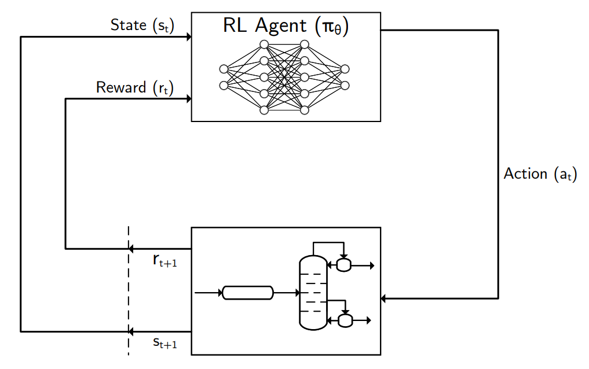
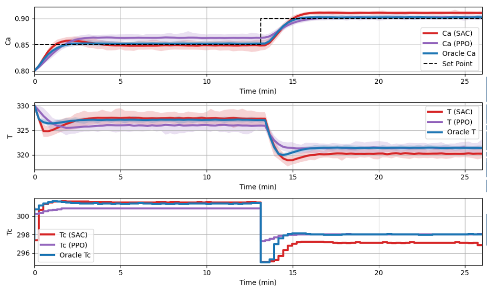

<!--more-->

 | 
--- | ---

<<<<<<< HEAD
The chemical industry requires efficient control systems to operate at the border of process constraints while optimizing for profit, safety, and sustainability. Reinforcement Learning (RL) is a control philosophy that aims to address the complex control problems present in chemical systems. RL utilises plant data to improve its control performance and has several advantages over other control strategies such as its offline inference time and flexibility to adapt to changing plant conditions. However, RL is an active area of research to develop and implement algorithms suitable for industrial useglobal optimum due to its inherent robustness.
=======
The chemical industry requires efficient control systems to operate at the border of process constraints while optimizing for profit, safety, and sustainability. Reinforcement Learning (RL) is a control philosophy that aims to address the complex control problems present in chemical systems. RL utilises plant data to improve its control performance and has several advantages over other control strategies such as its offline inference time and flexibility to adapt to changing plant conditions. However, RL is an active area of research to develop and implement algorithms suitable for industrial use global optimum due to its inherent robustness.
>>>>>>> 45fef293bad45213e1e49db40da7d42cc67812b3

